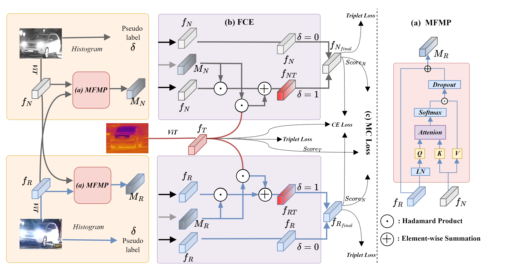

# FACENet: **Flare-Aware Cross-modal Enhancement Network for Multi-spectral Vehicle Re-identification**

Authors: Aihua Zheng, Zhiqi Ma, Yongqi Sun, Zi Wang, Chenglong Li*, Jin Tang

[Paper](https://www.sciencedirect.com/science/article/pii/S1566253524005785)



Multi-spectral vehicle Re-identification (Re-ID) aims to incorporate complementary visible and infrared information to tackle the challenge of re-identifying vehicles in complex lighting conditions. However, in harsh environments, the discriminative cues in RGB (visible) and NI (near infrared) modalities are significantly lost by the strong flare from vehicle lamps or the sunlight. To handle this problem, we propose a **Flare-Aware Cross-modal Enhancement Network (FACENet)** to adaptively restore the flare-corrupted RGB and NI features with the guidance from the flare-immunized TI (thermal infrared) spectrum.


## Highlights

-  A mutual flare mask prediction module that predicts the flare mask through flare-affected RGB and NI modalities.
-  A flare-aware enhancement module that enhances masked RGB and NI features using flare-immunized TI information.
-  A multi-modal consistency loss to enhance semantic consistency in multi-spectral vehicle under intense flare.
-  A more realistic and comprehensive large-scale Wild Multi-spectral Vehicle Re-ID dataset WMVeID863.

## 
### Datasets
WMVeID863    [Google Drive](https://drive.google.com/file/d/186Ep0YgHY0a8BQ1Z59HP1D2-kZazbH02/view?usp=drive_link)
RGBNT100    [Baidu Pan](https://pan.baidu.com/s/1xqqh7N4Lctm3RcUdskG0Ug)(Code: rjin) 
MSVR310     [Google Drive](https://drive.google.com/file/d/1IxI-fGiluPO_Ies6YjDHeTEuVYhFdYwD/view?usp=drive_link)

### Pretrained
[ViT-B](https://github.com/rwightman/pytorch-image-models/releases/download/v0.1-vitjx/jx_vit_base_p16_224-80ecf9dd.pth)

### Configs
WMVeID863	file: `FACENet/configs/WMVeID863/facenet_wmveid863.yml`  
RGBNT100	file: `FACENet/configs/RGBNT100/facenet_rgbnt100.yml`  
MSVR310	file: `FACENet/configs/MSVR310/facenet_msvr310.yml`

### Base
```bash
#!/bin/bash
source activate (your env)
cd ../(your path)
pip install -r requirements.txt
```
### Train
python train.py --config_file configs/WMVeID863/facenet_wmveid863.yml

### Test

python test.py --config_file configs/WMVeID863/facenet_wmveid863.yml


## Citation
If you find FACENet useful in your research, please consider citing:
```bibtex
@article{zheng2024facenet,
    author = {Aihua Zheng and Zhiqi Ma and Yongqi Sun and Zi Wang and Chenglong Li and Jin Tang},
    title = {Flare-Aware Cross-modal Enhancement Network for Multi-spectral Vehicle Re-identification}, 
    journal={Information Fusion},
    year = {2024}
}
